<div align="center">
  
</div>

<div align="center">
  
</div>


<p align="center">
  <a href="mailto:shahidseran786@gmail.com">
    
  </a>
  <a href="https://wa.me/918920339780">
    
  </a>
  <a href="https://www.linkedin.com/in/shahid-khan-1a471b153/">
    
  </a>

</p>


<div align="center">
  
  
</div>


<br>

<!-- <div align="center">

</div> -->


<br>

## 🚀 About Me

```typescript
interface Developer {
  name: string;
  location: string;
  roles: string[];
  currentFocus: string;
  passions: string[];
}

const shahid: Developer = {
  name: "Shahid Khan",
  location: "India 🇮🇳",
  roles: ["Full Stack Developer", "Node.js Developer", "React Developer"],
  currentFocus: "Learning & Building AI-integrated backend systems",
  passions: [
    "Building scalable backend architectures 💻",
    "Developing dynamic frontend applications ⚛️",
    "Contributing to open-source projects 🌟",
    "Continuous learning and knowledge sharing 📚"
  ]
};

// Staying focused and delivering excellence, one commit at a time. 🚀
console.log(`${shahid.name} is crafting scalable digital solutions with discipline and creativity.`);
```

<br clear="right"/>

## 🎯 Current Mission

<div align="center">
<table width="100%">
<tr>
<td width="50%" valign="top">

### 🏢 Professional Journey
- **💻 Full Stack Development** – Building scalable web applications
- **🔥 Node.js Backend Engineering** – API design, WebSockets, AI integrations
- **⚛️ React Development** – Interactive frontend interfaces
- **☁️ DevOps Learning** – Docker, CI/CD, Kubernetes fundamentals
- **📚 Data Structures & Algorithms** – Daily problem-solving for optimal solutions

</td>
<td width="50%" valign="top">

### 🌍 Community Impact
- **🌟 Open Source Contributions** – Projects and issue resolution
- **📝 Knowledge Sharing** – StackOverflow, GitHub discussions
- **🏆 Competitive Programming** – LeetCode & HackerRank challenges
- **🤝 Collaborative Learning** – Supporting peers in their coding journey
- **🎯 Continuous Improvement** – Embracing latest tech trends and practices

</td>
</tr>
</table>
</div>


## 🛠️ Tech Arsenal

<div align="center">

### 💻 Languages
<p>
  
</p>

### 🚀 Backend Frameworks & Libraries
<p>
  
</p>

### ⚛️ Frontend Frameworks & Libraries
<p>
  
  
  
</p>

### ⚡ Real-time & APIs
<p>
  
  
</p>

### 🗄️ Databases & ORMs
<p>
  
</p>

### ☁️ DevOps & Cloud
<p>
  
</p>

### 🛠️ Tools & Platforms
<p>
  
</p>

</div>


<details>
<summary>🔍 <strong>Detailed Tech Stack</strong></summary>
<br>

| Category | Technologies |
|----------|--------------|
| **Programming Languages** | C, C++, Java, JavaScript, TypeScript, Python, Bash |
| **Frontend Development** | React.js, Next.js, Redux Toolkit, HTML5, CSS3, Tailwind CSS, Bootstrap |
| **Backend Development** | Node.js, Express.js, Prisma, Sequelize, Socket.io, REST APIs |
| **Databases** | MySQL, PostgreSQL, SQLite, MongoDB |
| **DevOps & Infrastructure** | Docker, Kubernetes (learning), GitHub Actions, CI/CD |
| **Cloud Platforms** | AWS (learning), Azure (learning) |
| **Real-time & API Libraries** | Axios, Socket.io |
| **Version Control & Tools** | Git, GitHub, VSCode, Linux, Postman, Figma |

</details>


## 📊 GitHub Analytics

<div align="center">
  
  
</div>

<div align="center">
  
</div>

<div align="center">
  
</div>


## 🎯 2025 Vision

```mermaid
graph LR
    A[🚀 Master Node.js + DevOps] --> B[⚡ Build Scalable Backend Systems]
    B --> C[🤖 Integrate AI into Applications]
    C --> D[☁️ Achieve AWS & DevOps Certifications]
    D --> E[🌟 Contribute to Major Open Source Projects]
    E --> F[🎤 Deliver Tech Talks & Workshops]
    F --> G[📚 Share Knowledge through Blogs]
```

<div align="center">



<div align="center">
  
  ### 💬 Always excited to discuss:
  **🚀 Innovative Backend Solutions** • **⚛️ React Development** • **☁️ DevOps Practices** • **🤖 AI Integrations** • **🌟 Open Source Contributions** • **🎯 Career Growth**
  
</div>

<p align="center">
  <a href="mailto:shahidseran786@gmail.com">
    
  </a>
  <a href="https://linkedin.com/in/md-shahid-khan-1a471b153">
    
  </a>
  <a href="https://twitter.com/vampsdamon59922">
    
  </a>
  <a href="https://leetcode.com/shahid_vk18">
    
  </a>
</p>

<div align="center">
  
  ### 💡 "Code is disciplined creativity – every bug is just an opportunity to improve."

  **Thanks for visiting – let's build scalable, innovative systems together! 🚀**
  
</div>
